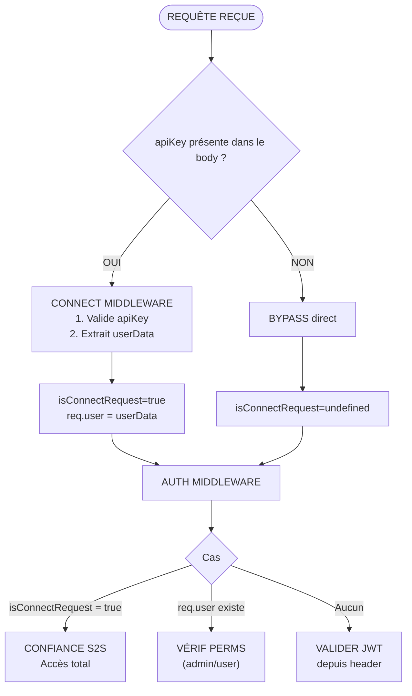
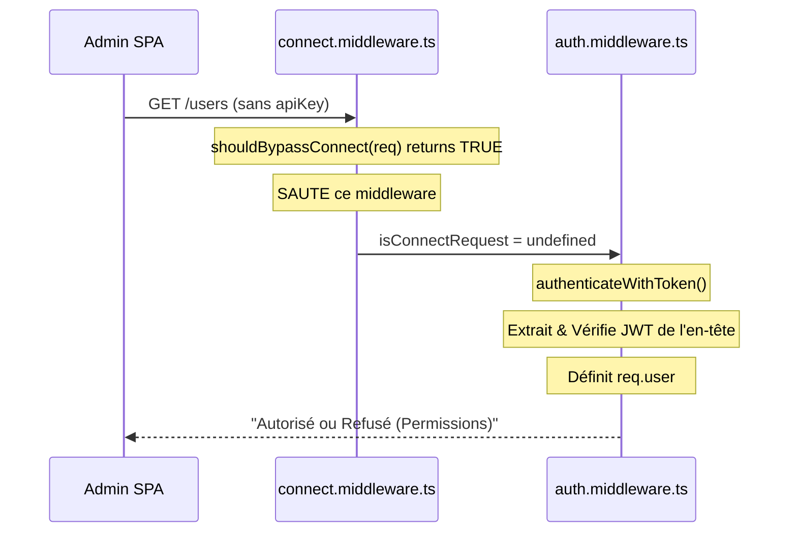

# Architecture d'authentification

## Contexte

Le backend sert trois types de clients avec différents modèles de confiance :

1. **Utilisateurs externes** via Connect Gateway
2. **Services internes** (communication S2S)
3. **Admin SPA** (accès direct Backoffice)

Nous avions besoin d'un flux d'authentification unifié gérant les trois sans duplication de code.

## Décision

### Flux d'authentification

### Chemins d'accès

| Chemin  | Client              | apiKey | JWT validé par | `isConnectRequest` | `req.user`      |
| ------- | ------------------- | ------ | -------------- | ------------------ | --------------- |
| Gateway | Utilisateur externe | Oui    | Connect        | `true`             | Depuis userData |
| S2S     | Service interne     | Oui    | N/A            | `true`             | `undefined`     |
| Direct  | Admin SPA           | Non    | Backend        | `undefined`        | Depuis JWT      |

### Détails d'implémentation

1. **`shouldBypassConnect()`** - Retourne `true` si pas d'`apiKey`, saute le middleware connect.

2. **Flag `isConnectRequest`** - Défini à `true` uniquement avec une `apiKey` valide.

3. **Contexte utilisateur** - Peut provenir de :
   - `userData` de Connect (chemin Gateway)
   - JWT dans l'en-tête Authorization (chemin Direct)

### Flux SPA Direct (sans apiKey de Connect)

### Cycle de vie du token

- **Génération :** Backend (`security.generateToken()`, `security.generateAdminToken()`)
- **Validation (Gateway) :** Connect Gateway
- **Validation (Direct) :** Backend (`security.verifyToken()`)

Les deux doivent utiliser le même `JWT_SECRET` / `CONNECT_JWT_SECRET`.

## Conséquences

### Positives

- Une seule pile middleware gère tous les patterns d'accès
- Pas de validation JWT redondante
- Les services S2S ont un accès complet avec la clé API
- Séparation claire des frontières de confiance

### Négatives

- `JWT_SECRET` doit être synchronisé entre Connect et Backend
- L'accès SPA direct nécessite de maintenir `verifyToken()` dans le Backend

## Fichiers Concernés

- `src/middleware/connect.middleware.ts`
- `src/middleware/auth.middleware.ts`
- `src/utils/security.ts`
