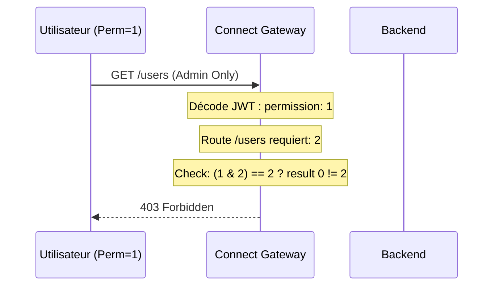
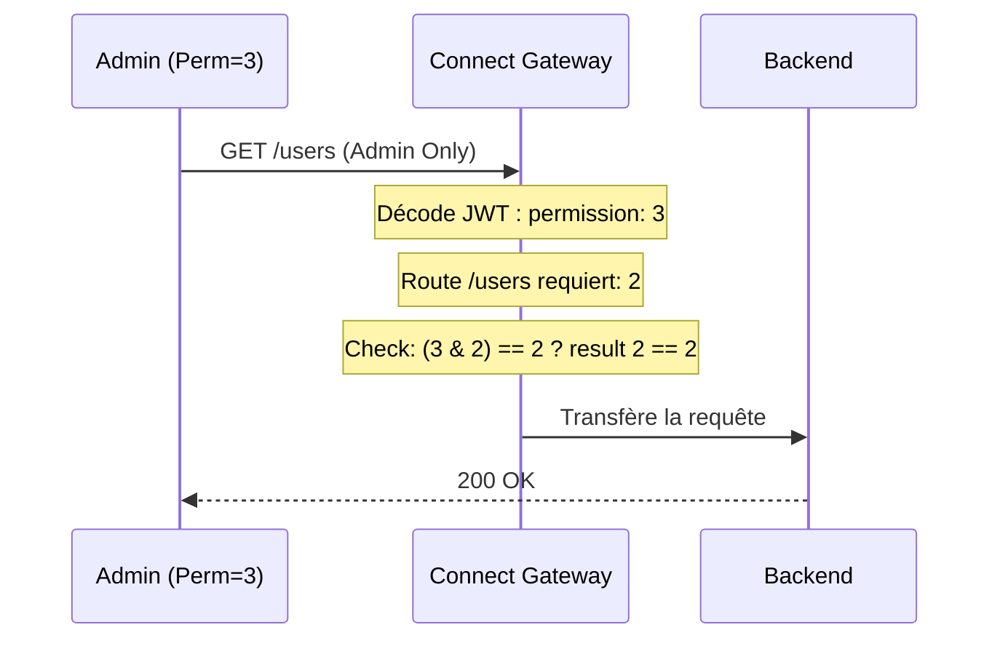

# Permissions & autorisations

## Vue d'ensemble

Le Backend applique les permissions à deux niveaux :

1. **Connect (Gateway)** - Vérifie l'accès AVANT de transférer au Backend
2. **Backend** - Vérifie à nouveau en backup (défense en profondeur)

## Niveaux de permission (bitmask)

| Permission  | Valeur | Binaire | Description                     |
| ----------- | ------ | ------- | ------------------------------- |
| Public      | 0      | 00      | Aucune authentification requise |
| Authentifié | 1      | 01      | Utilisateurs connectés          |
| Admin       | 3      | 11      | Accès total (auth + admin)      |

> **Note :** Admin = 3 (pas 2) pour avoir accès aux routes authenticated ET admin.

## Vérification des permissions

Connect et Backend utilisent le même check bitmask :

```
(user.permission & route.permission) === route.permission
```

### Exemples

| User Perm | Route Perm | Calcul    | Résultat |
| --------- | ---------- | --------- | -------- |
| 1 (user)  | 1 (auth)   | 1 & 1 = 1 | Autorisé |
| 3 (admin) | 1 (auth)   | 3 & 1 = 1 | Autorisé |
| 3 (admin) | 2 (admin)  | 3 & 2 = 2 | Autorisé |
| 1 (user)  | 2 (admin)  | 1 & 2 = 0 | Refusé   |

## Flux : Requête vers route protégée



Admin (permission=3) accède à la même route :



## Configuration des routes

Définie dans `src/middleware/routes.config.ts` :

```typescript
export const ROUTES: Route[] = [
  // PUBLIC (permission: 0)
  { path: '/auth/login', method: 'POST', access: 'public' },

  // AUTHENTIFIÉ (permission: 1)
  { path: '/subscriptions', method: 'GET', access: 'authenticated' },

  // ADMIN (permission: 2 - mais user doit avoir 3 pour y accéder)
  { path: '/users', method: 'GET', access: 'admin' },
];
```

## Fichiers concernés

- `src/middleware/routes.config.ts` - Définitions d'accès aux routes
- `src/middleware/auth.middleware.ts` - Logique d'autorisation (bitmask)
- `src/utils/security.ts` - Génération des tokens (user=1, admin=3)
