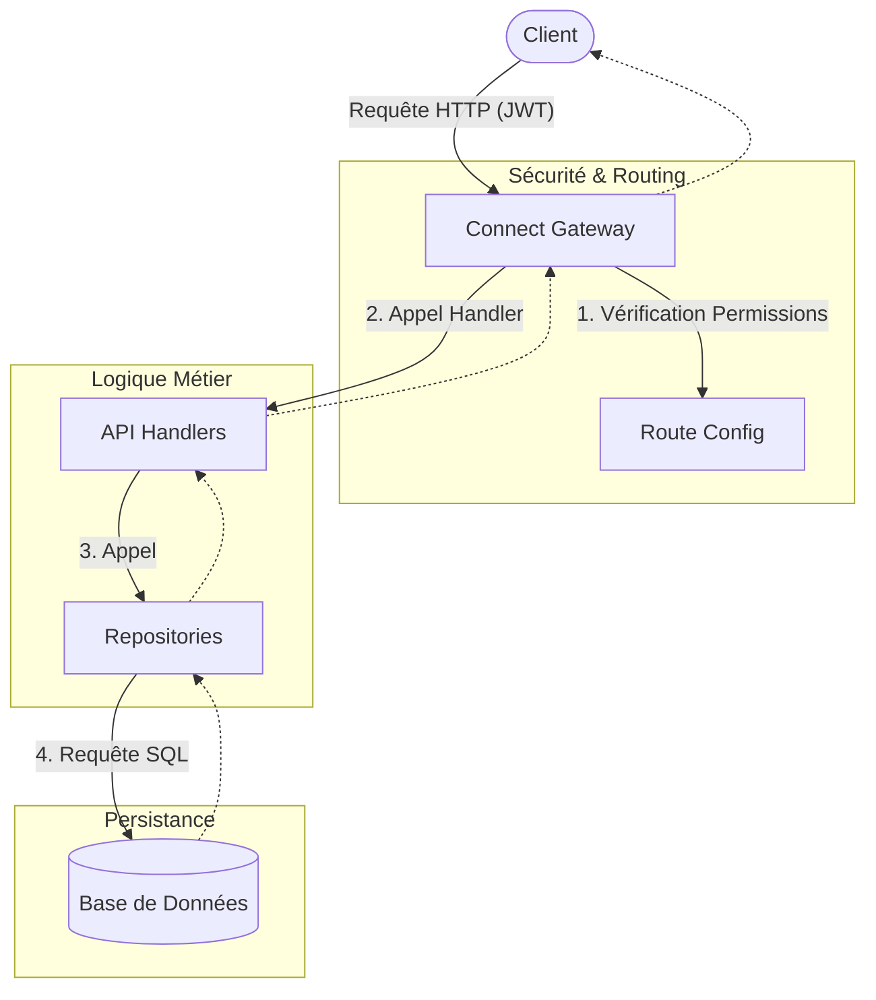

# Documentation du backend Gamers ERP

Ce projet fournit les services backend nécessaires à la gestion des abonnements, des utilisateurs et des opérations financières du système Gamers ERP.

## Résumé du projet

L'API est conçue avec une approche **Design-First** utilisant OpenAPI pour garantir un contrat d'interface robuste. Elle suit une architecture en couches pour assurer la séparation des préoccupations et la testabilité.

### Points clés :
- **Sécurité** : Authentification JWT centralisée et gestion des permissions par bitmask.
- **Flexibilité** : Support multi-base de données (SQLite en mémoire pour le dev/test, PostgreSQL pour la prod).
- **Automatisation** : Génération de code (routes, types, schémas de validation) depuis la spec OpenAPI.

## Flux de communication

Le diagramme suivant illustre le cheminement d'une requête type à travers les différents composants du système :

## Navigation rapide

- **[Architecture Decision Records](architecture/001-adr.md)** : Les choix techniques structurants du projet.
- **[Démarrage rapide](demarrage-rapide.md)** : Installation et exécution du projet.
- **[Référence API](api/README.md)** : Détails des endpoints par domaine métier.
